# 🤝 Pactora: The Ultimate Offline Integrity & Commitment Tracker

  

  <strong>Never forget a promise. Restore integrity to your relationships.</strong> 
  <em>100% Offline • Zero Tracking • Privacy-First Architecture</em>

---

## 🌟 The Philosophy: Radical Privacy

In an era of relentless data harvesting and cloud synchronization, **Pactora** stands as a sanctuary for your personal commitments. Built on the **Privacy-First, Offline-Always (PFOA)** manifesto, Pactora ensures that your financial IOUs, borrowed physical assets, and solemn promises never leave your device. 

No accounts. No servers. No surveillance. Just pure accountability.

---

## 🚀 Key Feature Highlights

### 📝 Promise Engine
- Track commitments made by you (outbound) or to you (inbound).
- Set exact deadlines with **Exact Alarm** precision.
- Attachment support for proof of completion or original contracts.
- Smart recurrence (Daily, Weekly, Monthly) for habitual commitments.

### 💰 Money Ledger
- Informal debt and credit tracking for friends and family.
- **Global Currency Support:** Dynamic symbols for INR, USD, EUR, GBP, JPY, and more.
- Partial settlement tracking with automated balance calculation.
- Color-coded visual cues (Red for Debt, Green for Credit).

### 📦 Asset Borrow/Lend
- Document physical item transfers (e.g., tools, books, electronics).
- Record item condition at handover with high-resolution photos.
- Automatic return reminders to prevent "forgotten" items.

### 👥 Relationship Directory
- Unified history for every person in your life.
- View a master ledger of every promise, payment, and item shared with a contact.
- Sync from device contacts for seamless entry.

### 📊 Visual Analytics
- **Dashboard Summary:** High-level matrix of your current status.
- **Interactive Calendar:** Visual dot-indicators for upcoming deadlines.
- **Timeline:** An immutable chronological log of every action taken.
- **Stats:** Data-driven charts showing category distribution and financial ratios.

---

## 📸 Screen-by-Screen Gallery

> *Note: Place your screenshots in the `/screenshots` directory and link them below.*

### 1. The Dashboard (Command Center)
| Overview | Profile | Statistics |
| :---: | :---: | :---: |
| 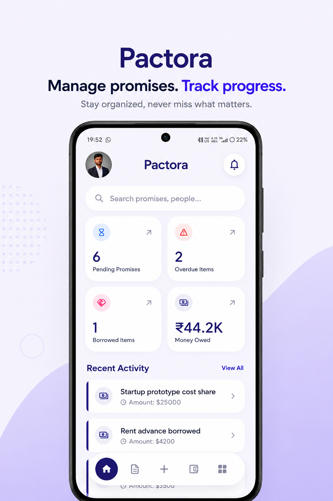 | 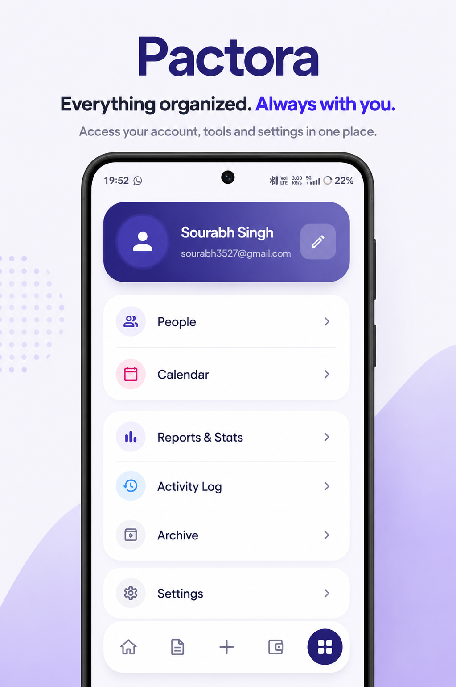 | 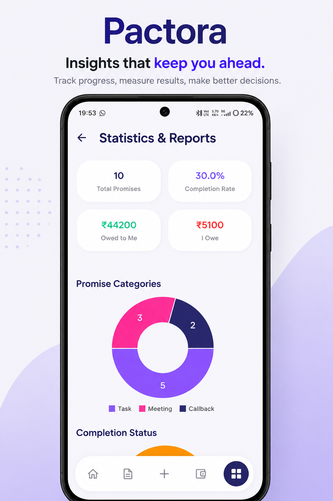 |
| *Master view showing your integrity score and key stats.* | *Dynamic grid tracking Pending, Overdue, and Money.* | *Real-time feed of your latest updates.* |

### 2. Money Ledger
| Record List | Transaction Details | Add/Edit Record |
| :---: | :---: | :---: |
| 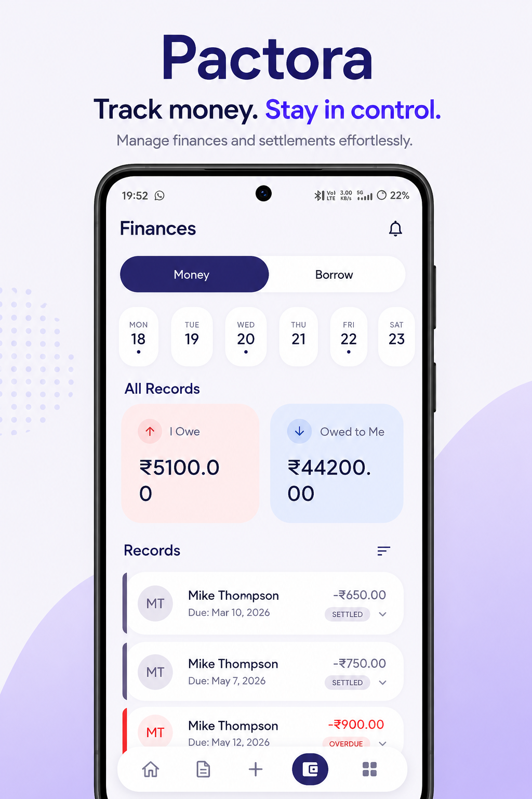 | 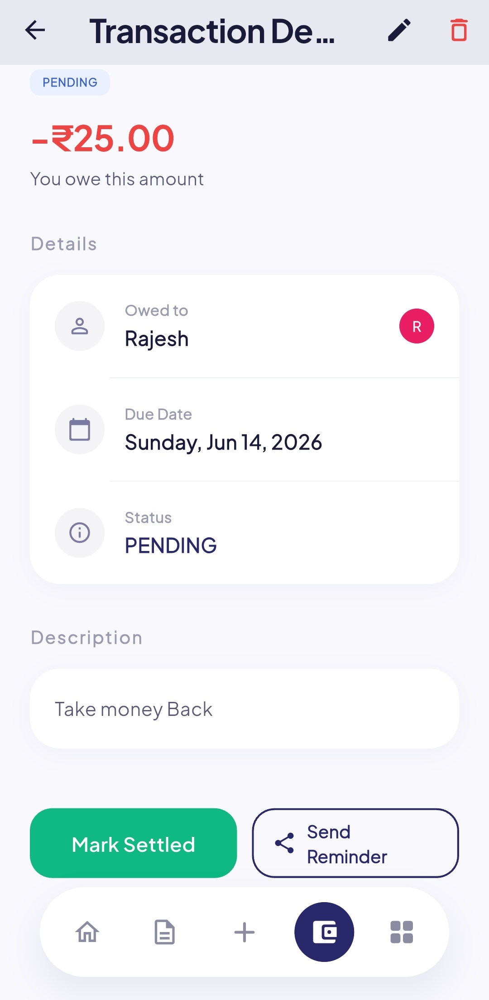 | 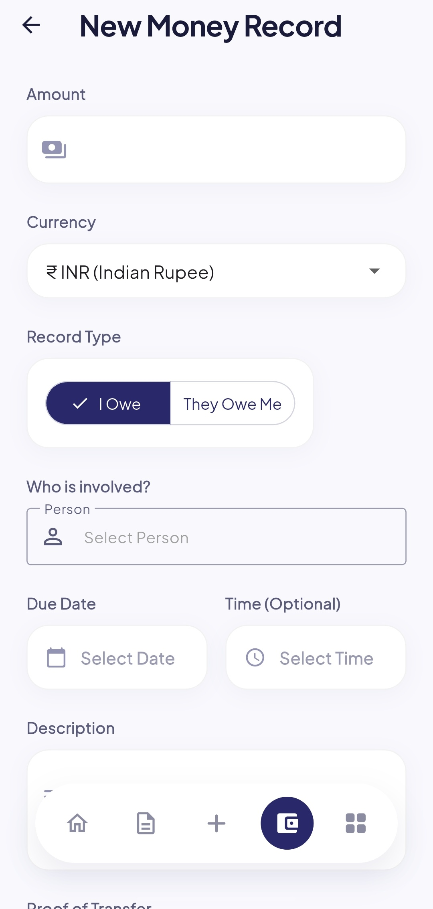 |
| *Clean, color-coded list of all financial commitments.* | *Detailed view with proof photos and history.* | *Sleek input form with currency and time pickers.* |

### 3. Promise Tracker
| Active Promises | Details Page | Add/Edit Record |
| :---: | :---: | :---: |
| 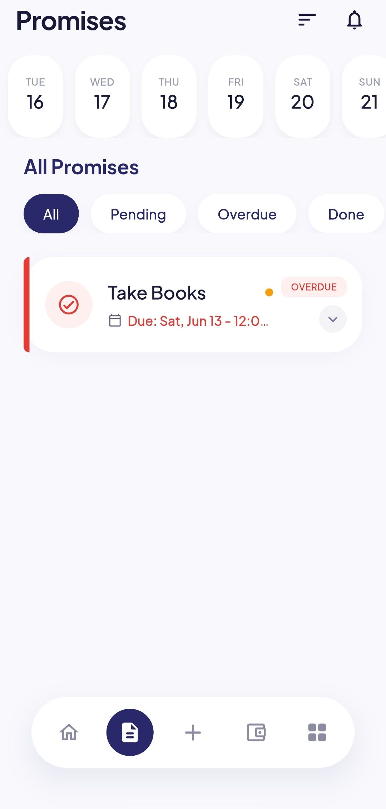 | 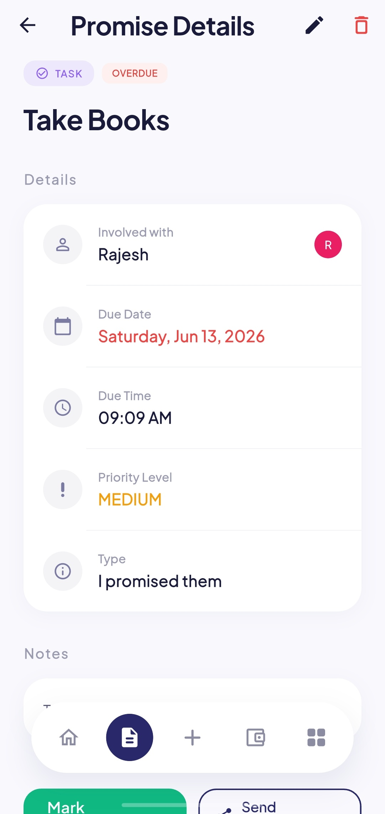 | 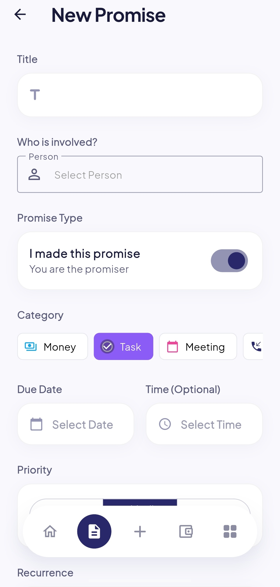 |
| *Filter by priority and status to stay focused.* | *Configure habitual tasks with zero-effort setup.* | *Capture images as evidence of your word.* |

### 4. Borrow & Lend
| Item Catalog | Handover Condition | Return Reminders |
| :---: | :---: | :---: |
| 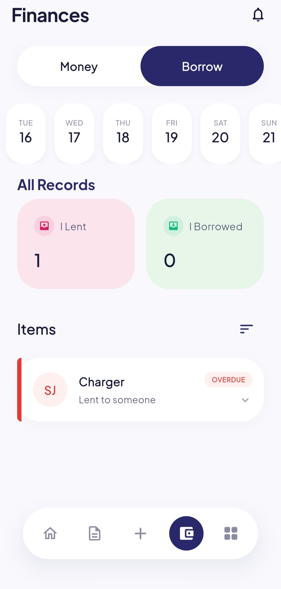 | 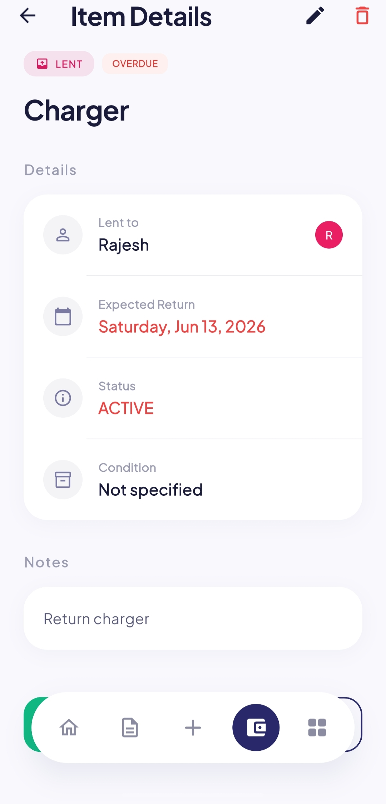 |  |
| *Keep track of who has your things and when they're coming back.* | *Note item state to avoid disputes later.* | *Automated exact alerts for return dates.* |

### 5. Advanced Visualization & Tools
| Personal Stats | Global Calendar | Timeline Feed |
| :---: | :---: | :---: |
|  | 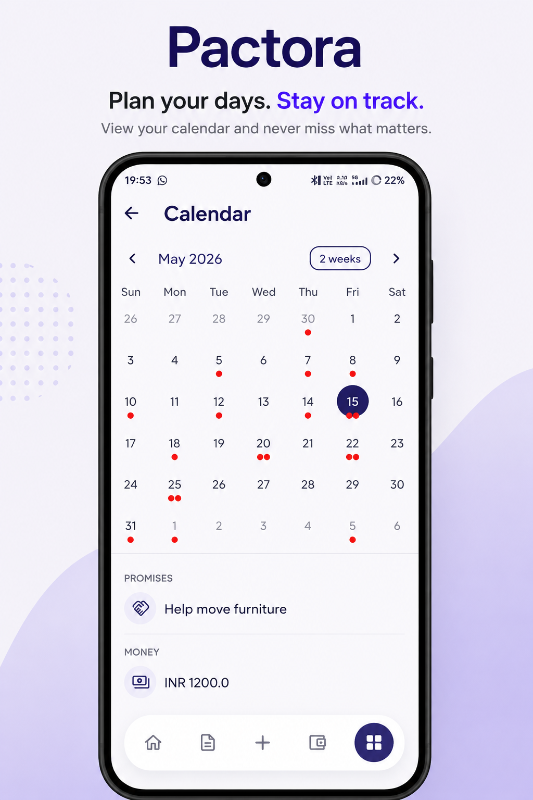 | 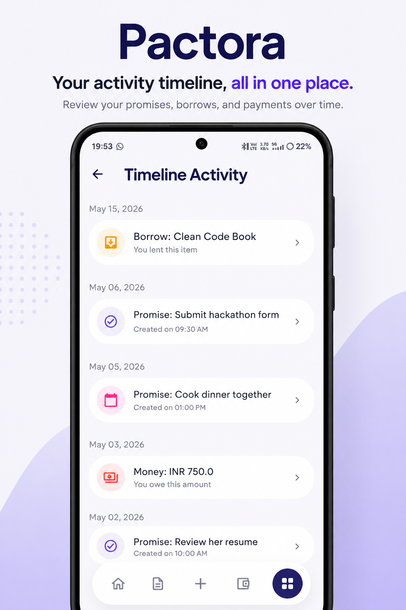 |
| *Deep-dive into your commitment patterns.* | *Visual roadmap of your month's deadlines.* | *Every action you've ever taken, recorded.* |
---

## 📱 Google Play Store Launch

We are thrilled to announce that **Pactora** is now officially available for download on the Google Play Store! Join thousands of users who are restoring integrity to their relationships with our offline-first commitment tracker.

   
  <em>(Note: Replace dummy link with actual store URL after production rollout)</em>

---

## 🚀 Key Feature Highlights
...
---

## 🛠 Technical Architecture & Deep Tech Stack

Pactora is engineered for performance, security, and extreme reliability. Below is an exhaustive breakdown of the technologies that power our offline-first experience.

### Core Framework & Language
- **[Flutter 3.19.0+](https://flutter.dev/):** Utilized for its high-performance rendering engine (Skia/Impeller) and multi-platform consistency.
- **[Dart SDK 3.0.0+](https://dart.dev/):** Leverages sound null safety and efficient AOT (Ahead-of-Time) compilation for native machine code performance.

### State Management & Dependency Injection
- **[Riverpod 2.5](https://riverpod.dev/):** The standard for modern Flutter development. We use the **Code Generation** variant (`riverpod_generator`) to ensure:
  - **Compile-time safety:** No runtime provider exceptions.
  - **Auto-disposal:** Optimal memory management by killing providers when screens are popped.
  - **Global Access:** Seamless data flow across Dashboard, Promises, and Finance modules.

### High-Performance Local Storage
- **[Isar 3.1 (NoSQL)](https://isar.dev/):** A lightning-fast database designed specifically for Flutter.
  - **ACID Compliant:** Ensures your commitments are never lost during a crash or power failure.
  - **Static Typing:** Direct mapping between Dart objects and database collections.
  - **Powerful Queries:** Complex filtering for the Search and Timeline modules without the overhead of SQL.
  - **Asynchronous Execution:** All DB operations run in a background isolate to keep the UI at a buttery-smooth 60/120 FPS.

### Declarative Navigation
- **[GoRouter 13.2](https://pub.dev/packages/go_router):** A robust routing solution that handles:
  - **Deep Linking:** Capability to jump into specific promise or money records.
  - **Nested Navigation:** Persistent shell for the bottom navigation bar.
  - **State-based Redirection:** Automatically redirecting users to Premium or Onboarding based on local preferences.

### Notification & Alarm System
- **[Flutter Local Notifications](https://pub.dev/packages/flutter_local_notifications):** The backbone of our reminder engine.
- **Exact Alarms (`SCHEDULE_EXACT_ALARM`):** Targeted implementation for Android 11 to 16, ensuring your "9:00 AM" reminder triggers at exactly 9:00 AM, bypassing OS battery optimization (Doze mode).

### UI/UX & Design Components
- **Material 3 (M3):** Full implementation of Google's latest design language, featuring:
  - **Adaptive Color Palettes:** Dynamic UI that shifts based on status (e.g., Red for Debt, Blue for Pending).
  - **Custom Typography:** Integrated with [Google Fonts](https://pub.dev/packages/google_fonts).
  - **Interactive Elements:** [Flutter Slidable](https://pub.dev/packages/flutter_slidable) for quick swipe actions (Archive/Delete/Pay).
  - **Data Visualization:** [FL Chart](https://pub.dev/packages/fl_chart) for high-performance financial and task analytics.

### Third-Party Integrations (Privacy-Friendly)
- **Google Mobile Ads (AdMob):** Monetization engine for the free tier, restricted to technical metadata.
- **In-App Purchase (IAP):** Native Play Store billing integration for seamless Premium upgrades.
- **Share Plus:** One-tap sharing of commitment reminders via WhatsApp, Telegram, or SMS.
- **Fast Contacts:** High-speed contact synchronization logic.

---

## 🛡 Security & Privacy Model

- **Local Storage:** All user data is stored in the app's internal storage sandbox. No other apps can access it.
- **Manual Backups:** Use the **Export Backup** feature to create an encrypted `.pactora` file. You are responsible for where you save this file.
- **Zero Cloud:** We do not provide cloud sync. If you lose your phone and don't have a backup file, your data is gone—just the way a private app should be.
- **Biometric Ready:** The app supports system-level locking to keep your commitments private even from people you hand your phone to.

---

## 💎 Monetization: Pactora Premium

Pactora is free to use with limited records. The **Premium Upgrade** allows the developer to keep the app ad-free and server-less.
- **Benefits:**
  - Unlocked Unlimited Records (Promises, Money, Items).
  - 100% Ad-Free Experience.
  - Support for Independent, Privacy-First Software.
  - Lifetime Purchase and Subscription options available.

---

## 📄 Legal & Compliance

Exhaustive documentation is available in the `docs/` folder:
- [Detailed Privacy Policy](PRIVACY_POLICY.md)
- [Terms of Use & License](TERMS_OF_USE.md)
- [Master User Guide](HOW_TO_USE.md)

---

## 👨‍💻 Developer & Support

- **Developer:** Sourabh Singh
- **Contact:** sourabh3527@gmail.com
- **Website:** [sooubh.github.io/pactora](https://sooubh.github.io/pactora/)

---

  Made with ❤️ by Sourabh Singh. Stay honest. Stay accountable.

