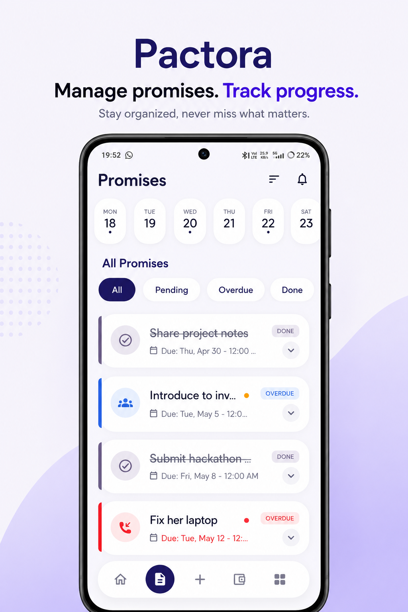

  

<h1 align="center">Pactora</h1>

  <strong>A Case Study in Privacy-First, Offline-Always Engineering</strong> 
  <em>Restoring integrity to personal relationships through professional-grade accountability.</em>

  
  

  

---

## 💡 Why I Built Pactora

In a hyper-connected world, we’ve outsourced our memory to chaotic chat histories and fleeting notifications. I noticed a recurring friction in my own life and the lives of those around me: **The Integrity Gap.**

Small promises ("I'll send that link"), informal debts ("I'll pay for lunch"), and borrowed items ("Can I borrow your drill?") often drift into a void of "I forgot." These aren't just missed tasks; they are micro-fractures in trust. 

I built Pactora to bridge this gap. I wanted a tool that didn't just remind me *what* to do, but held me accountable for *who* I said I would be. It needed to be faster than a note, more structured than a chat, and—above all—completely private.

---

## 🎯 The Product: Accountability as a Service

Pactora is a personal integrity tracker designed to manage the high-friction commitments of real life.

- **The Promise Engine:** A dedicated workflow for tracking outbound (my word) and inbound (their word) commitments with exact-time accountability.
- **The Money Ledger:** A zero-friction financial log for informal debts and credits, supporting multi-currency partial settlements.
- **The Asset Vault:** A photographic record of borrowed and lent physical items, ensuring "forgotten" assets always return home.
- **The Relationship Ledger:** A unified 360-degree view of every commitment, payment, and item shared with a specific person.

  
  

---

## 🏗️ Engineering Decisions: The "Offline-Always" Stack

Choosing the right architecture was critical to the product's mission of radical privacy. Here is the rationale behind the primary technical choices:

### **Flutter & Dart**
I chose Flutter for its high-performance **Skia/Impeller** rendering engines. Accountability requires a "buttery" UI that feels as reliable as the promises it tracks. Dart’s sound null safety ensures that the application’s state remains predictable and crash-free.

### **Isar Database (NoSQL)**
Standard SQL felt too heavy for a local-only mobile app. Isar was chosen for its extreme speed and ACID compliance. It allows Pactora to perform complex queries (like the Timeline and Relationship history) directly on-device in background isolates without ever blocking the UI thread.

### **Riverpod (Reactive State Management)**
To handle the "Dashboard Matrix"—where a change in a Money record must instantly update the Global Summary and the People Ledger—I implemented Riverpod. Its unidirectional data flow and compile-time safety make state synchronization across modules seamless.

### **Exact Alarm Architecture**
Standard mobile notifications are often delayed by OS power-saving modes. I implemented a custom `SCHEDULE_EXACT_ALARM` wrapper to ensure that "Accountability Alarms" trigger precisely when promised, maintaining the app's core value proposition of reliability.

---

## 🔒 Privacy-First Architecture

Pactora operates on a **Privacy-First, Offline-Always (PFOA)** manifesto.

- **Zero Servers:** There is no "Pactora Cloud." Your data is stored in the device's internal app sandbox.
- **Local Sovereignty:** No telemetry, no tracking, and no identity mapping. 
- **User-Led Portability:** Migrations are handled via manual, encrypted backups, ensuring the user remains the sole custodian of their history.

---

## 🎓 What I Learned Building This

Building Pactora was a masterclass in the intersection of **Product Thinking** and **Mobile Engineering**.

1.  **UX for Intent:** I learned that friction is sometimes a feature. By making the "Proof Photo" or "Condition Note" a core part of the workflow, users feel a higher sense of commitment to the record.
2.  **The Isolate Pattern:** Handling heavy NoSQL writes on a mobile device taught me the deep importance of Dart Isolates and asynchronous database management to maintain 120 FPS.
3.  **App Store Persistence:** Navigating the Google Play Store's latest "Exact Alarm" and "Background Task" policies was a lesson in adapting technical architecture to evolving platform constraints.
4.  **Privacy as a Technical Constraint:** Building a complex app without a backend forced me to solve data synchronization and backup challenges entirely through on-device logic and file-system manipulation.

---

## 🗺️ Roadmap

- [ ] **Cross-Platform Sync:** Peer-to-peer encrypted synchronization without a central server.
- [ ] **Accountability Analytics:** Visualizing "Integrity Streaks" and commitment completion ratios.
- [ ] **Desktop Companion:** Bringing the PFOA ledger to macOS and Windows for professional follow-ups.

---

## 👨‍💻 Developer & Case Study Author

**Sourabh Singh**
*Full-Stack Mobile Engineer & Product Thinker*

  
  
  

---

  <em>"Integrity is doing the right thing, even when no one is watching."</em>

  Made with ❤️ by Sourabh Singh.

